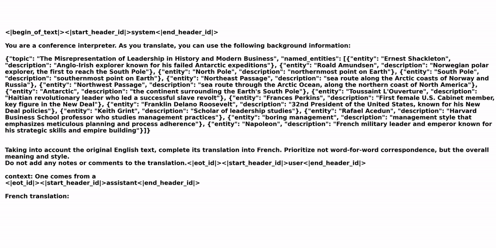

# toLLMatch🔪: Context-aware LLM-based simultaneous translation

**Paper**: https://arxiv.org/abs/2406.13476



# Abstract

The advent of transformers has fueled progress in machine translation. More recently large language models (LLMs) have come to the spotlight thanks to their generality and strong performance in a wide range of language tasks, including translation. Here we show that open-source LLMs perform on par with or better than some state-of-the-art baselines in simultaneous machine translation (SiMT) tasks, zero-shot. We also demonstrate that injection of minimal background information, which is easy with an LLM, brings further performance gains, especially on challenging technical subject-matter. This highlights LLMs' potential for building next generation of massively multilingual, context-aware and terminologically accurate SiMT systems that require no resource-intensive training or fine-tuning.


# Quick start

## 1 Set up the environment and install dependencies

We tested this code with CUDA 12.2 and python 3.10.14. 🙏**Please**🙏 open an issue if something breaks or if you can't make it work on your system.

0) **Patch the paths to various datafiles:**

```bash
cd scripts
python patch_paths.py
```

1) **Rename `.env.example` to `.env` and set the enviroment variables.**

```bash
PATH_ROOT=<absolute_path_to_where_you_cloned_this_repo_to>
HF_HOME=<\PATH\TO\YOUR\HUGGINGFACE_CACHE>
VLLM_SERVER_ENDPOINT_URL=http://<IP_or_LOCALHOST>:<PORT>/generate
ASR_SERVER_ENDPOINT_URL=http://<IP_or_LOCALHOST>:<PORT>
```
the the VLLM and ASR servers, use `localhost` if you run them on the same machine as the evaluation script (see below). Otherwise, use the IP address of the machine hosting the server.

2) **Install essential dependencies (preferably into a clean environment):**

```bash
conda create -n tollmatch python=3.10.14
conda activate tollmatch
cd scripts
sh install_requirements.sh
```

The full list of dependencies is in `requirements.txt`.

## 2 Spin up the ASR server

We compartmentalize the SiMT system components into three separate sub-systems: ASR server, LLM server and the evaluation script.

Start the ASR server (using `whisper-jax`) on the specified device:

```bash
cd evaluation
python asr_server.py \
    --model_size distil-large-v3 \
    --device 0 \
    --port <PORT> # must match the port in `ASR_SERVER_ENDPOINT_URL`
```

The `--model_size` parameter accepts one of the following: `small`, `medium`, `large-v3`, `distil-large-v3`. The first 3 will load the vanilla (relatively large) versions of Whisper and the last one will use the distilled version of the latest `whisper-larger-v3`. `small` is (almost) as good as the others.


If you have issues with `jax`, try this alternative ASR server:

```bash
cd evaluation
python asr_server_distil.py \
    --model_size distil-large-v3 \
    --device 0 \
    --port <PORT> # must match the port in `ASR_SERVER_ENDPOINT_URL`
```


## 3 Spin up the LLM inference server

The following command will start the LLM server on port `8001`. This port must match with the port you specify as part of the `VLLM_SERVER_ENDPOINT_URL` parameter in `.env`. Depending on how many GPUs you have on your machine, adjust the `--tensor-parallel-size` parameter. Also make sure that `<\PATH\TO\YOUR\HUGGINGFACE_CACHE>` matches the value `HF_HOME` you set in `.env`.

```bash
cd evaluation
volume=<\PATH\TO\YOUR\HUGGINGFACE_CACHE> # must be the same as in `.env`
LLM_MODEL=meta-llama/Meta-Llama-3-70B-Instruct
python3 -m vllm.entrypoints.api_server \
    --model $LLM_MODEL \
    --port 8001 \
    --tensor-parallel-size 8 \
    --download-dir $volume \
    --max-num-seqs 2
```

Specify `--tensor-parallel-size 1` with a small model (e.g. `meta-llama/Meta-Llama-3-8B-Instruct`) to be sure nothing breaks. 

## 4 Run evaluation

The results of all the following evaluation scripts will be saved to `evaluation/ONLINE_TARGETS/<SCRIPT_NAME>_<RUN_ID>`

### Speech-to-text (S2TT)

To evaluate on the `TED-TST-2024` on English-German simultaneous translation, do

```bash
cd scripts
bash EVAL_ENDE_S2TT_TED2024.sh
```

Modify the paths in `EVAL_ENDE_TED2024.sh` if you want to evaluate the method on other data, language pairs, LLM size, ASR model size, in a different latency regime, or on a specified subset of the data, adjust the corresponding parameters in the script.

### Text-to-text (T2TT)

To isolate the performance of the LLM from the ASR-related errors, you might want to evaluate the method in T2TT mode:

```bash
cd scripts
bash EVAL_ENDE_T2TT_TED2023.sh
```

# Data

This repo already has everything you need to reproduce the results in the paper:

- `evaluation/SOURCES` contains the audio file lists as well as text sources (for T2TT)
- `evaluation/OFFLINE_TARGETS` has the corresponding refrence translations
- `evaluation/BACKGROUND_INFO` contains background information for context-aware SiMT.

If you need the scripts for building (or expanding) `TED-TST-2024`, please open an issue and we'll add them to the repo.

# Baselines

in `baselines/` you'll find everything you need to run the test on selected baselines. Before you run the bash scripts, specify the necessary paths inside them.

- [NAIST](https://github.com/ahclab/naist-simulst)

```bash
cd baselines/naist-simulst
bash RUN_EVAL_ted_tst_2023.sh
```

- [FBK](https://github.com/hlt-mt/FBK-fairseq/)

Follow the instruction in the `baselines/FBK-fairseq/fbk_works/EDATT_SIMULST_AGENT_ACL2023.md`, download `checkpoint_avg7.pt` and put it in `baselines/FBK-fairseq/DATA_ROOT/`.

```bash
cd baselines/FBK-fairseq
bash RUN_EVAL_ted2024.sh
```

- [SeamlessStreaming](https://github.com/facebookresearch/seamless_communication)

```bash
cd baselines/seamless-streaming
bash RUN_ted_tst_2024_ende.sh
```

- [TransLLaMa](https://github.com/RomanKoshkin/transllama)

Please clone this [repo](https://github.com/RomanKoshkin/transllama) separately, and follow the instructions.

# Citation

```bash
@misc{koshkin2024llms,
      title={LLMs Are Zero-Shot Context-Aware Simultaneous Translators}, 
      author={Roman Koshkin and Katsuhito Sudoh and Satoshi Nakamura},
      year={2024},
      eprint={2406.13476},
      archivePrefix={arXiv},
      primaryClass={id='cs.CL' full_name='Computation and Language' is_active=True alt_name='cmp-lg' in_archive='cs' is_general=False description='Covers natural language processing. Roughly includes material in ACM Subject Class I.2.7. Note that work on artificial languages (programming languages, logics, formal systems) that does not explicitly address natural-language issues broadly construed (natural-language processing, computational linguistics, speech, text retrieval, etc.) is not appropriate for this area.'}
}
```